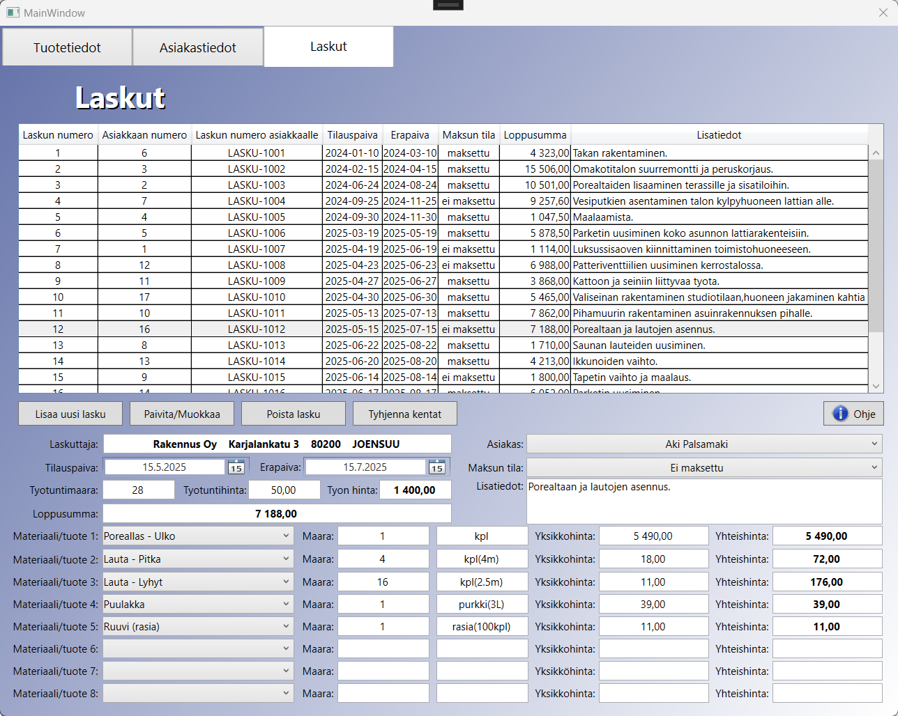

# 🧾 LaskutusOhjelma (Invoicing Software for a Construction Company)

*A WPF-based full-stack invoicing application built in C# for a fictional construction company, featuring SQLite, MVVM architecture, and a clean modern UI.*

- This is an invoicing and customer management application that provides tools for handling invoices, customers, and products. It's been built with C# and WPF (.NET 8.0) technologies.

- My goal for this project was to create a visually clear and user-friendly invoicing system with a strong focus on usability and user experience (UX).

- The program features a local SQLite database that stores all invoices, customers, and products locally on your device within the application's folder.

- If you are a non-Finnish speaker, I apologize that the application's language is in Finnish. In such case, it might be a bit harder to follow what's happening in the program.

<em>Main invoices view (Laskut tab)</em>

---

## ⭐ Features

- **Product management:** Add, edit, remove, and view products.
- **Customer registry:** Manage customers, companies, and organizations.
- **Invoicing system:** Create, edit and view invoices, payment status, and totals (sums). 
- **Data control:** Clear input fields, prevent duplicate entries, and reset the database.
- **SQLite database:** No external server or cloud required.
- **Offline functionality:** Fully operational without an internet connection.
- **Modern WPF UI:** Professional look built with XAML.

---

## ⚡ Technologies Used

| Technology | Description |
|:--|:--|
| **.NET Desktop Runtime, version 8.0** |  Execution environment |
| **C#** | Programming language |
| **XAML** | UI definition language |
| **WPF (Windows Presentation Foundation)** | Desktop UI framework |
| **SQLite (Microsoft.Data.Sqlite)** | Local database engine |
| **MVVM architecture** | Organized folder structure separating UI and business logic |
| **Visual Studio Enterprise 2022** | Development environment |

---

## 🧩 Try Out the Software

If you already have **.NET Desktop Runtime (version 8.0 or newer)** installed, use the smaller build:

[⬇️ Download the 1 MB version (Requires .NET Desktop Runtime)](Try%20the%20Software%20(Download%20ZIP)%20-%20Extract%20and%20Launch%20the%20EXE/1%20MB%20Version%20-%20Requires%20.NET%20installed.zip)

You can also test the application without installing .NET:

[⬇️ Download the 59 MB version (No .NET installation required)](Try%20the%20Software%20(Download%20ZIP)%20-%20Extract%20and%20Launch%20the%20EXE/59%20MB%20Version%20-%20No%20.NET%20required.zip)

> 💡 If you need to install the runtime manually, you can download **.NET Desktop Runtime 8.0** from Microsoft:  
> [https://dotnet.microsoft.com/en-us/download/dotnet/8.0](https://dotnet.microsoft.com/en-us/download/dotnet/8.0)

---

## 💻 Source Code

For IT-savvy users, the full Visual Studio project is available in the **Source Code** folder.
It can be opened, for example, in Visual Studio 2022 or Visual Studio Code.

---

## ⚙️ How to Run the Application

1. Download and extract the chosen ZIP file.
2. Open the extracted folder.
3. Double-click the "LaskutusOhjelma.exe" file to launch the application.

The application is portable, so there's no need to install it. Just extract one of the .zip files and run LaskutusOhjelma.exe file!

---
## 💬 More about the Project

- This project was originally developed as a University of Applied Sciences (UAS) coursework assignment using MariaDB as its database. It was later refined and converted to use SQLite for easier execution, distribution, and inclusion in my personal portfolio, as well as to demonstrate practical skills in modern C# development, WPF UI design, and database handling.

- This was the first full-stack application I've ever made, and we students were definitely thrown straight into the deep end. If you wanted to reach the level of application I created, you had to work really hard for it.

- I used AI assistance in some parts of the code. It's hard to estimate how much it helped, but it definitely sped things up.

- There are a few things in the program that might look non-standard from an experienced developer's perspective, but some of them were done intentionally to make the project easier to build. For instance, I didn't implement any asynchronous (async) operations. This can be noticed in certain situations where the program takes a bit longer to load.

- Each time the application is launched, the existing database is deleted and a new one is created, so in this version of the program, there's no way to save things in between closing and relaunching the program. This behavior is intentional and was part of the original course project requirements.

- I intentionally used a soft delete approach when removing items from the Tuotetiedot (Product information), Asiakastiedot (Customer information), and Laskut (Invoices) tabs. This way, the data would actually remain in the database but not be visible or usable for the user. Instead of permanently deleting records from the database, they are marked as inactive by using flags like "IsActive". I remember thinking for a long time whether I wanted to do this using the soft delete method, and I came to the conclusion that doing it thsi way makes data management simpler and would be good enough for a small academic project like this.

- Let's end things with a few comments about the massive MainWindow.xaml.cs and MainWindow.xaml files, which together contain around 3,000 lines of code. The files became this big mainly because, on the frontend side, I used a TabControl layout component to simplify the task by placing the three main views of the application within a single window as tabs. (However probably not that simple for anyone else who has to read through those parts of the code. I truly feel sorry for anyone going through all that wall of text and trying to make sense of it 😄.) The files more than likely would have been quite large anyway, since if you split those 3000 lines into three separate windows, that would still be about 1000 lines per window, or about 500 if you count .xaml and .cs separately. I'm fully aware of the fact that these massive files aren't ideal, and that a developer should instead focus more on object-oriented programming. However, I did use the MVVM structure to keep things organized and manageable, so that was positive thing at least. The time we have in UAS with all of the studies going on is quite limited, so sometimes you have to take some shortcuts.

---

## 📜 License

© 2025 **Jesse Honkavaara**  
All rights reserved.  

This project is intended solely for demonstrating programming skills.  
Commercial use, redistribution, or modification of the code without permission is not allowed.